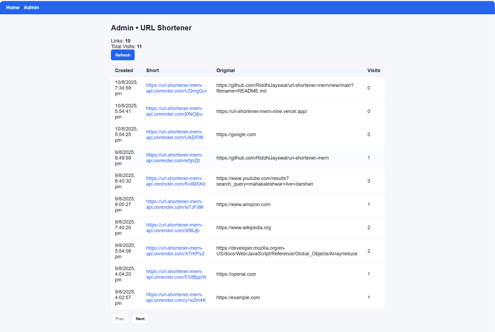

# 🔗 MERN URL Shortener

A full-stack **URL Shortener** application built with the **MERN stack** (MongoDB, Express.js, React.js, Node.js).  
This app allows users to shorten long URLs and access them easily.  
Includes an **admin panel** to monitor and manage shortened links.

---

## 🚀 Features

- Shorten any valid URL.
- Redirect shortened URL to the original URL.
- Admin dashboard to view all shortened URLs and their click counts.
- Backend API with MongoDB storage.
- CORS configuration for multiple frontends.
- Responsive frontend UI built with React + Vite.
- Fully deployed:
  - **Backend:** Render
  - **Frontend:** Vercel

---

## 🛠️ Tech Stack

**Frontend**
- React.js (Vite)
- Axios for API calls

**Backend**
- Node.js
- Express.js
- MongoDB (Mongoose)
- CORS
- dotenv

---

## 📂 Project Structure
```text
url-shortener/
│
├─ backend/                      # Express.js backend
│  ├─ .env                       # Backend environment variables
│  ├─ server.js                  # Main server file
│  ├─ models/                    # Mongoose models
│  ├─ routes/                    # API routes
│  └─ controllers/               # Request handlers (optional)
│
├─ frontend/                     # React + Vite frontend
│  ├─ .env                       # Frontend environment variables (VITE_*)
│  ├─ src/                       # React components
│  ├─ App.jsx
│  └─ main.jsx
│
└─ README.md
```

---

## ⚙️ Environment Variables

### **Backend (.env)**
```env
MONGODB_URI=mongodb+srv://<username>:<password>@cluster0.mongodb.net/
BASE_URL=https://url-shortener-mern-api.onrender.com
ADMIN_API_KEY=dev-admin-123
CORS_ORIGIN=https://riddhi-jayswals-projects.vercel.app,https://url-shortener-mern-riddhi-jayswals-projects.vercel.app,https://url-shortener-mern-nine.vercel.app
NODE_VERSION=20
```
### **Frontend (.env)**
```env
VITE_API_BASE=https://url-shortener-mern-api.onrender.com
VITE_ADMIN_KEY=dev-admin-123
```
---
## 🖥️ Running Locally

### Backend
```bash
cd backend
npm install
npm run dev
```
### Frontend
```bash
cd frontend
npm install
npm run dev
```

## 📸 Screenshots

### Homepage


### Admin Panel


